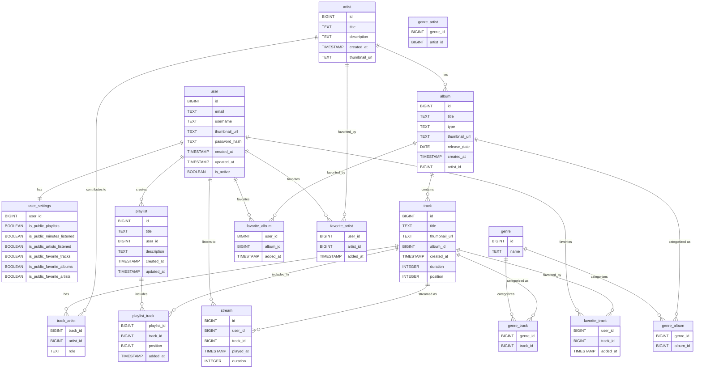

```mermaid
erDiagram
    user {
        BIGINT id
        TEXT email
        TEXT username
        TEXT thumbnail_url
        TEXT password_hash
        TIMESTAMP created_at
        TIMESTAMP updated_at
        BOOLEAN is_active
    }

    user_settings {
        BIGINT user_id
        BOOLEAN is_public_playlists
        BOOLEAN is_public_minutes_listened
        BOOLEAN is_public_artists_listened
        BOOLEAN is_public_favorite_tracks
        BOOLEAN is_public_favorite_albums
        BOOLEAN is_public_favorite_artists
    }

    genre {
        BIGINT id
        TEXT name
    }

    artist {
        BIGINT id
        TEXT title
        TEXT description
        TIMESTAMP created_at
        TEXT thumbnail_url
    }

    album {
        BIGINT id
        TEXT title
        TEXT type
        TEXT thumbnail_url
        DATE release_date
        TIMESTAMP created_at
        BIGINT artist_id
    }

    track {
        BIGINT id
        TEXT title
        TEXT thumbnail_url
        BIGINT album_id
        TIMESTAMP created_at
        INTEGER duration
        INTEGER position
    }

    track_artist {
        BIGINT track_id
        BIGINT artist_id
        TEXT role
    }

    playlist {
        BIGINT id
        TEXT title
        BIGINT user_id
        TEXT description
        TIMESTAMP created_at
        TIMESTAMP updated_at
    }

    playlist_track {
        BIGINT playlist_id
        BIGINT track_id
        BIGINT position
        TIMESTAMP added_at
    }

    genre_track {
        BIGINT genre_id
        BIGINT track_id
    }

    genre_album {
        BIGINT genre_id
        BIGINT album_id
    }

    genre_artist {
        BIGINT genre_id
        BIGINT artist_id
    }

    favorite_track {
        BIGINT user_id
        BIGINT track_id
        TIMESTAMP added_at
    }

    favorite_album {
        BIGINT user_id
        BIGINT album_id
        TIMESTAMP added_at
    }

    favorite_artist {
        BIGINT user_id
        BIGINT artist_id
        TIMESTAMP added_at
    }

    stream {
        BIGINT id
        BIGINT user_id
        BIGINT track_id
        TIMESTAMP played_at
        INTEGER duration
    }

    user ||--|| user_settings : "has"
    user ||--o{ playlist : "creates"
    user ||--o{ stream : "listens to"
    artist ||--o{ album : "has"
    album ||--o{ track : "contains"
    
    track ||--o{ track_artist : "has"
    artist ||--o{ track_artist : "contributes to"
    
    playlist ||--o{ playlist_track : "includes"
    track ||--o{ playlist_track : "included_in"
    track ||--o{ stream : "streamed as"
    
    genre ||--o{ genre_track : "categorizes"
    track ||--o{ genre_track : "categorized as"
    
    genre ||--o{ genre_album : "categorizes"
    album ||--o{ genre_album : "categorized as"
    
    user ||--o{ favorite_track : "favorites"
    track ||--o{ favorite_track : "favorited_by"
    
    user ||--o{ favorite_album : "favorites"
    album ||--o{ favorite_album : "favorited_by"
    
    user ||--o{ favorite_artist : "favorites"
    artist ||--o{ favorite_artist : "favorited_by"
```
