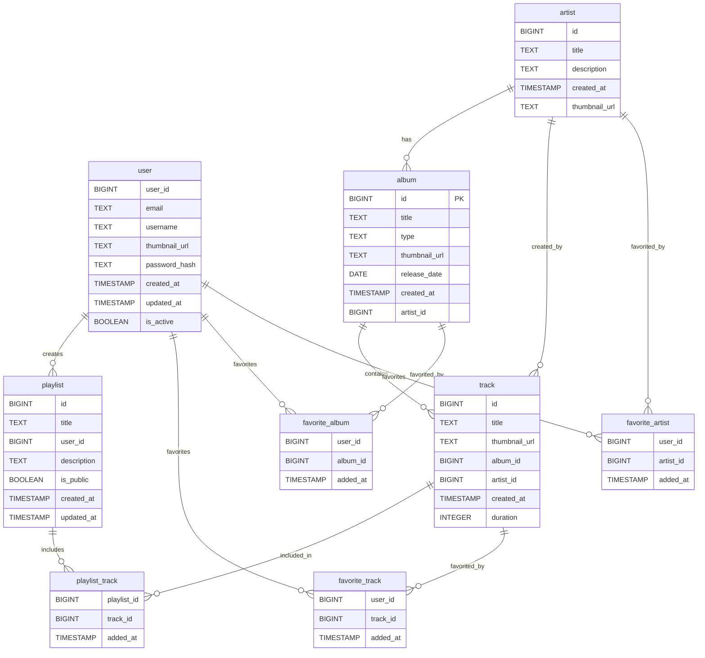

```mermaid
erDiagram
    user {
        BIGINT user_id
        TEXT email
        TEXT username
        TEXT thumbnail_url
        TEXT password_hash
        TIMESTAMP created_at
        TIMESTAMP updated_at
        BOOLEAN is_active
    }

    artist {
        BIGINT id
        TEXT title
        TEXT description
        TIMESTAMP created_at
        TEXT thumbnail_url
    }

    album {
        BIGINT id PK
        TEXT title
        TEXT type
        TEXT thumbnail_url
        DATE release_date
        TIMESTAMP created_at
        BIGINT artist_id
    }

    track {
        BIGINT id
        TEXT title
        TEXT thumbnail_url
        BIGINT album_id
        BIGINT artist_id
        TIMESTAMP created_at
        INTEGER duration
    }

    playlist {
        BIGINT id
        TEXT title
        BIGINT user_id
        TEXT description
        BOOLEAN is_public
        TIMESTAMP created_at
        TIMESTAMP updated_at
    }

    playlist_track {
        BIGINT playlist_id
        BIGINT track_id
        TIMESTAMP added_at
    }

    favorite_track {
        BIGINT user_id
        BIGINT track_id
        TIMESTAMP added_at
    }

    favorite_album {
        BIGINT user_id
        BIGINT album_id
        TIMESTAMP added_at
    }

    favorite_artist {
        BIGINT user_id
        BIGINT artist_id
        TIMESTAMP added_at
    }

    user ||--o{ playlist : "creates"
    artist ||--o{ album : "has"
    album ||--o{ track : "contains"
    artist ||--o{ track : "created_by"
    playlist ||--o{ playlist_track : "includes"
    track ||--o{ playlist_track : "included_in"
    user ||--o{ favorite_track : "favorites"
    track ||--o{ favorite_track : "favorited_by"
    user ||--o{ favorite_album : "favorites"
    album ||--o{ favorite_album : "favorited_by"
    user ||--o{ favorite_artist : "favorites"
    artist ||--o{ favorite_artist : "favorited_by"
```
